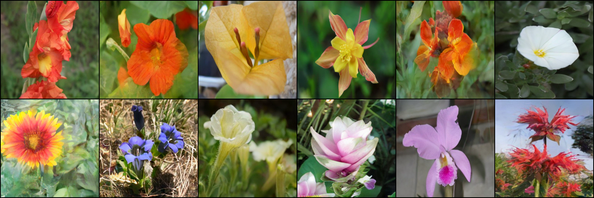

# Multimodal Meanflow: Text2Image

This repository implements a one-step generative Flow Matching model based on [MeanFlow](https://arxiv.org/abs/2505.13447).
## Framework
```bash
[ Text Prompts ] → Token Embeddings → Latent Variable Z₀ 
                                               │
                                               ▼
                                          [ MeanFlow ]
                                               │
                                               ▼
                                       Latent Variable Z₁ → VAE.decode(Z₁)
                                                                   │
                                                                   ▼
                                                               [ Images ]
```

## Prompts:
    1) a close up of a sword lily with orange flowers
    2) a watercress in a flower pot
    3) a yellow bougainvillea in the middle of the plant
    4) a yellow columbine in the garden
    5) a wallflower in the garden
    6) a white silverbush in the middle of a flower
    7) a blanket flower with a yellow and red flower
    8) a small blue stemless gentian in the grass
    9) a close up of a white petunia
    10) a pink siam tulip with white flowers on a green background
    11) a pink ruby-lipped cattleya with a white background
    12) a close up of a red bee balm
    
## One-step Generated Samples:


## Pretrained Models:
### Image to latent space:
```
from diffusers.models import AutoencoderKL
vae = AutoencoderKL.from_pretrained("stabilityai/sd-vae-ft-mse").eval()
```
### Prompts to latent space:
```
from transformers import AutoTokenizer, AutoModel
pre_tokenizer = AutoTokenizer.from_pretrained("intfloat/e5-base")
pre_model = AutoModel.from_pretrained("intfloat/e5-base")
```


