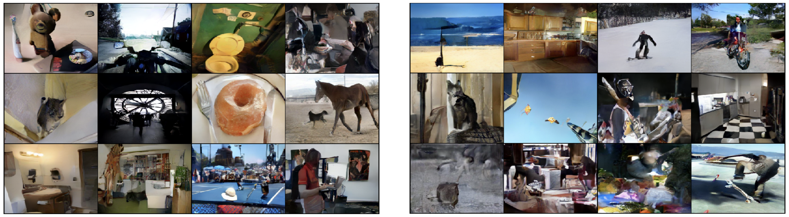

# Multimodal Meanflow: Text2Image

This repository implements a one-step generative Flow Matching model based on [MeanFlow](https://arxiv.org/abs/2505.13447).
## Framework
```bash
[ Text Prompts ] → Token Embeddings → Latent Variable Z₀ 
                                               │
                                               ▼
                                          [ MeanFlow ]
                                               │
                                               ▼
                                       Latent Variable Z₁ → VAE.decode(Z₁)
                                                                   │
                                                                   ▼
                                                               [ Images ]
```

## Prompts
    Flowers:
    1) a close up of a sword lily with orange flowers
    2) a watercress in a flower pot
    3) a yellow bougainvillea in the middle of the plant
    4) a yellow columbine in the garden
    5) a wallflower in the garden
    6) a white silverbush in the middle of a flower
    7) a blanket flower with a yellow and red flower
    8) a small blue stemless gentian in the grass
    9) a close up of a white petunia
    10) a pink siam tulip with white flowers on a green background
    11) a pink ruby-lipped cattleya with a white background
    12) a close up of a red bee balm

    COCO Dataset:
    1) A brown teddy bear standing next to a toothbrush.              |     1) A green umbrella sitting on top of a sandy beach.
    2) Riding a motorcycle down a street that has no one ...          |     2) A country charm type of kitchen is equipped with ...
    3) The toilet is in a room with exposed pipes.                    |     3) A man riding a snowboard down the side of a ski slope.
    4) A couple of men sitting at a table having dinner ...           |     4) A man stands beside his black and red motorcycle...
    5) A cat walking on the top of an open door.                      |     5) A calico cat standing on top of an upholstered chair.
    6) The silhouette of people is seen against the inside of ...     |     6) Many kites can be seen in the air through umbrellas.
    7) A donut on a plate with a fork and knife.                      |     7) A baseball player holding a wooden bat standing.
    8) A black dog running in a pen with a horse.                     |     8) A small kitchen inside of a dark office.
    9) A bathroom with a sink, paper roll, toilet, towel...           |     9) A herd of sheep standing in a snow-covered field.
    10) A living room filled with furniture and a staircase.          |     10) A table topped with glasses and eating utensils.
    11) A game of tennis on a blue court with an audience.            |     11) A little girl sitting at a table with lots of fruit ...
    12) A person and a laptop in a room.                              |     12) There is a male skateboarder doing a trick.
    

    
## One-step Generated Samples:




## Pretrained Models:
### Image to latent space:
```
from diffusers.models import AutoencoderKL
vae = AutoencoderKL.from_pretrained("stabilityai/sd-vae-ft-mse").eval()
```
### Prompts to latent space:
```
from transformers import AutoTokenizer, AutoModel
pre_tokenizer = AutoTokenizer.from_pretrained("intfloat/e5-base")
pre_model = AutoModel.from_pretrained("intfloat/e5-base")
```


